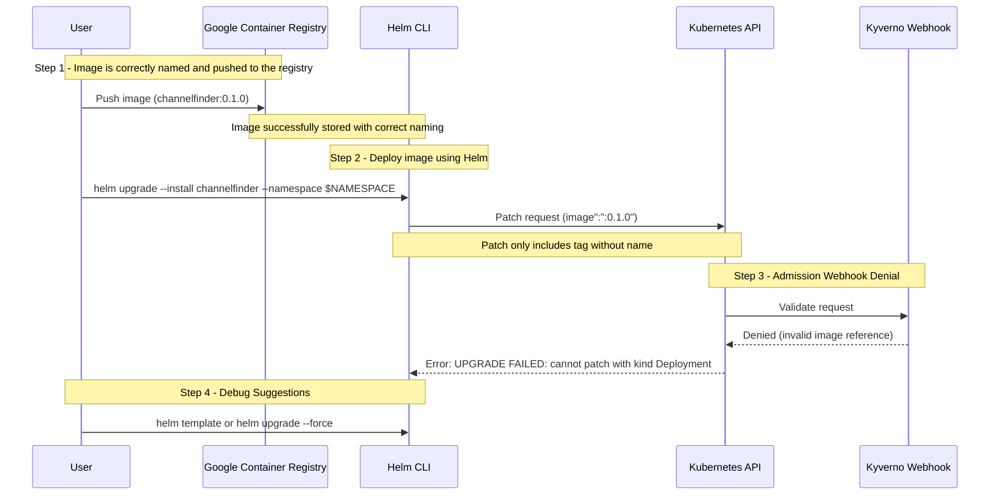

# name error

## diagram

```mermaid
sequenceDiagram
    participant User as User
    participant GCR as Google Container Registry
    participant Helm as Helm CLI
    participant KubeAPI as Kubernetes API
    participant Webhook as Kyverno Webhook

    Note over User, GCR: Step 1 - Image is correctly named and pushed to the registry

    User->>GCR: Push image (channelfinder:0.1.0)
    Note over GCR, Helm: Image successfully stored with correct naming

    Note over Helm: Step 2 - Deploy image using Helm

    User->>Helm: helm upgrade --install channelfinder --namespace $NAMESPACE

    Helm->>KubeAPI: Patch request (image":":0.1.0")
    Note over Helm, KubeAPI: Patch only includes tag without name

    Note over KubeAPI, Webhook: Step 3 - Admission Webhook Denial

    KubeAPI->>Webhook: Validate request
    Webhook-->>KubeAPI: Denied (invalid image reference)
    KubeAPI-->>Helm: Error: UPGRADE FAILED: cannot patch with kind Deployment

    Note over User, Helm: Step 4 - Debug Suggestions

    User->>Helm: helm template or helm upgrade --force
```

Note: the initial error was with `values.yaml` image.image field, where the key should have been image.repository.

